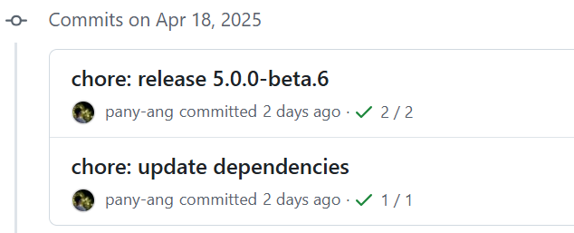

<div align="center">
  
  <h1>CS Admin Vite</h1>
</div>

## 简介

CS Admin Vite 是一个精心制作的后台管理系统模板，基于 Vue3、Vite、TypeScript、Element Plus 等主流技术。

## 使用

<details>
<summary>推荐环境</summary>

<br>

- `node` 20.x 或 22+
- `pnpm` 9.x 或 10+

</details>

<details>
<summary>本地开发</summary>

<br>

```bash
# 安装依赖
pnpm i

# 启动服务
pnpm dev
```

</details>

<details>
<summary>打包构建</summary>

<br>

```bash
# 打包构建预发布环境
pnpm build:staging

# 打包构建生产环境
pnpm build
```

</details>

<details>
<summary>本地预览</summary>

<br>

```bash
# 先执行打包构建命令生成 dist 目录后再执行以下预览命令
pnpm preview
```

</details>

<details>
<summary>代码检查</summary>

<br>

```bash
# 代码校验与格式化
pnpm lint
```

</details>

<details>
<summary>代码提交规范</summary>

<br>

`feat` 新功能

`fix` 修复错误

`perf` 性能优化

`refactor` 重构代码

`docs` 文档和注释

`types` 类型相关

`test` 单测相关

`ci` 持续集成、工作流

`revert` 撤销更改

`chore` 琐事（更新依赖、修改配置等）

</details>

## 与 V3 Admin Vite 同步进度



## License

[MIT](./LICENSE) License © 2025-PRESENT [csheng-coder](https://github.com/csheng-coder)
